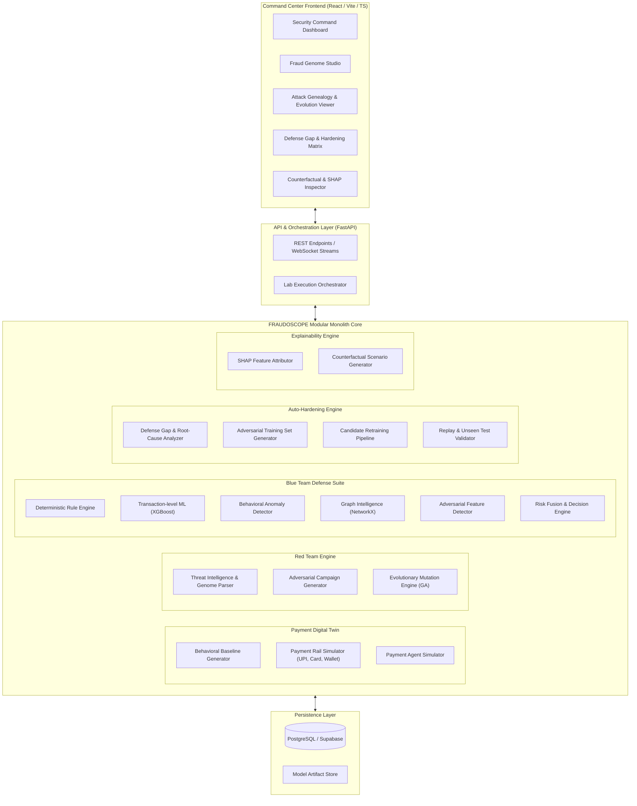
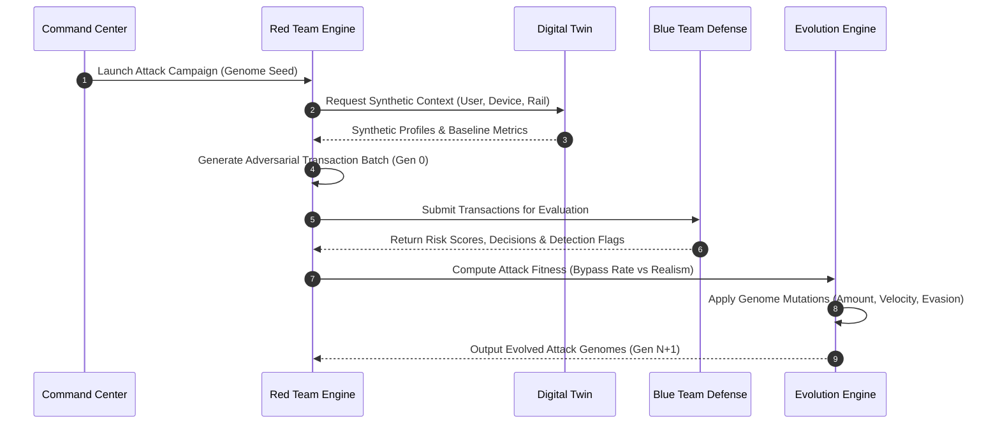
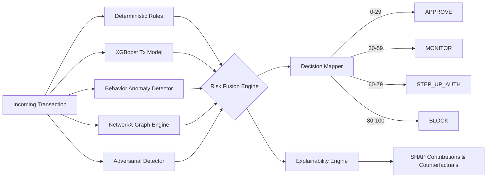
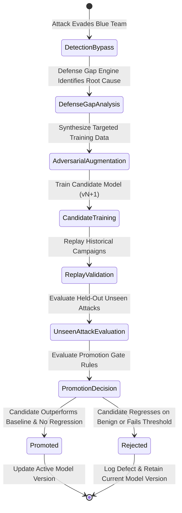

# FRAUDOSCOPE — Architecture Specification

> **System Architecture Version:** 1.0.0  
> **Pattern:** Modular Monolith with Event-Driven Simulation Core

---

## 1. System Context

FRAUDOSCOPE is an autonomous adversarial payment security sandbox that continuously evaluates and hardens fraud detection systems using synthetic payment behaviors, threat genomes, and Red-Team evolutionary mutations.



---

## 2. Major Component Modules

The application is structured into clearly isolated Python packages under `backend/app/`:

### 2.1 `core/`
- Infrastructure, database session management, central config, seed management, and security boundaries.

### 2.2 `digital_twin/`
- **Synthetic Payment Environment:** Models statistical user profiles, normal spending behavior, merchant velocity distribution, device fingerprinting, and session context.
- **Payment Rail Handlers:** Specialized wrappers for `UPI`, `Card`, and `Wallet` transactions.
- **Payment Agent Engine:** Simulates autonomous AI agent behaviors (scheduled micro-payments, automated bill-pay, agentic API delegates).

### 2.3 `threat_intel/`
- **Fraud Genome Schema:** Versioned JSON schema defining structured attack dimensions (objective, identity, device, location, amount, velocity, timing, merchant, rail, evasion, novelty).
- **Threat Taxonomy:** Catalog of standard payment attack vectors.

### 2.4 `red_team/`
- **Campaign Generator:** Translates a Fraud Genome into synthetic payment streams infused with adversarial traits.
- **Evolution Engine:** Genetic algorithm and heuristic mutation operators that mutate attack parameters across generations.
- **Fitness Evaluator:** Evaluates candidate attack mutations on multi-objective metrics:
  $$\text{Fitness} = w_1 \cdot \text{Stealth} + w_2 \cdot \text{Realism} + w_3 \cdot \text{Novelty} + w_4 \cdot \text{EvasionSuccess}$$

### 2.5 `blue_team/`
- **Rule Engine:** Deterministic pattern matcher checking velocity thresholds, geo-velocity violations, blackout window attempts, and blacklist matching.
- **Transaction ML Model:** XGBoost model trained on engineered transaction-level features.
- **Behavioral Anomaly Detector:** Isolation Forest / One-Class SVM measuring deviation from synthetic user baseline.
- **Graph Intelligence:** NetworkX graph analysis computing PageRank, degree centrality, connected component risk, and mule account cluster detection.
- **Adversarial Detector:** Identifies synthetic mutation signatures and feature boundary probing behavior.
- **Risk Fusion Engine:** Combines multi-layer signals into a unified 0–100 risk score and maps to decision tiers (`APPROVE`, `MONITOR`, `STEP_UP_AUTH`, `BLOCK`).

### 2.6 `hardening/`
- **Defense Gap Analyzer:** Correlates missed fraud (false negatives) with specific attack genome mutations and feature values.
- **Adversarial Data Synthesizer:** Constructs augmented training batches targeting discovered gaps.
- **Candidate Retraining Pipeline:** Trains updated model versions using strict seed isolation.
- **Model Promotion Guard:** Validates candidate models against replay benchmarks and held-out unseen attack scenarios. Models are promoted ONLY if performance strictly improves without degrading accuracy on benign transactions.

### 2.7 `explainability/`
- Computes SHAP feature contributions for high-risk decisions.
- Generates counterfactual explanations (e.g., *"If amount were \$45 instead of \$450 and device was recognized, risk would decrease from 82 to 24"*).

---

## 3. Detailed Data & Workflow Diagrams

### 3.1 Red Team Attack & Evolution Flow



### 3.2 Blue Team Detection & Risk Fusion Flow



### 3.3 Auto-Hardening & Promotion Flow



---

## 4. Data Boundaries & Leakage Isolation

To guarantee scientific validity, the data platform implements 3 isolated data tiers:

```
┌────────────────────────────────────────────────────────────────────────┐
│                        SYNTHETIC DATA SPLITS                           │
├───────────────────────────┬───────────────────────────┬────────────────┤
│    TRAINING SET (60%)     │    VALIDATION SET (20%)   │ UNSEEN TEST (20%)
│                           │                           │                │
│  - Baseline Benign Tx     │  - Hyperparameter tuning  │ - Held-out     │
│  - Known Attack Genomes   │  - Early stopping         │   Attack       │
│  - Gen 0-N Mutations      │  - Model validation       │   Families     │
│                           │                           │ - Novel Rail   │
│                           │                           │   Combinations │
└───────────────────────────┴───────────────────────────┴────────────────┘
```

---

## 5. Deployment & Runtime Architecture

- **Local Developer Setup:** Docker Compose running PostgreSQL, FastAPI, and Vite dev server.
- **Hosted Cloud Deployment:** Supabase (PostgreSQL) + FastAPI container (Cloud Run / App Engine) + Static Frontend (Vercel / Netlify / Cloudflare Pages).

---

## 6. Testing Strategy

1. **Unit Tests (`tests/unit/`):** Test isolated functions, math utilities, Pydantic validations, rule triggers, and mutation operators.
2. **Integration Tests (`tests/integration/`):** Test end-to-end flow from synthetic generation through risk fusion and database persistence.
3. **Reproducibility Tests (`tests/reproducibility/`):** Verify that deterministic seeds yield identical datasets and mutation paths.
4. **Frontend Unit & Component Tests:** Validate UI state transitions, graph renderings, and API response parsing.

---

## 7. Extensibility Matrix

- **Adding a New Payment Rail:** Implement `PaymentRail` interface in `digital_twin/rails/`, define schema in Pydantic, register in rail factory.
- **Adding a New Attack Family:** Define new JSON schema in `threat_intel/genomes/`, add mutation behaviors in `red_team/mutations/`.
- **Adding a New Blue Team Detector:** Create subclass of `BaseDetector` in `blue_team/detectors/`, register in `RiskFusionEngine`.
